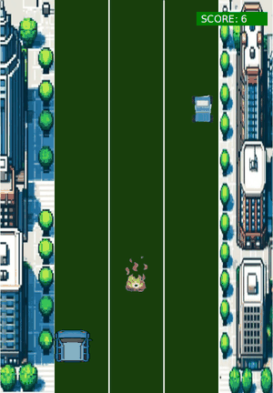
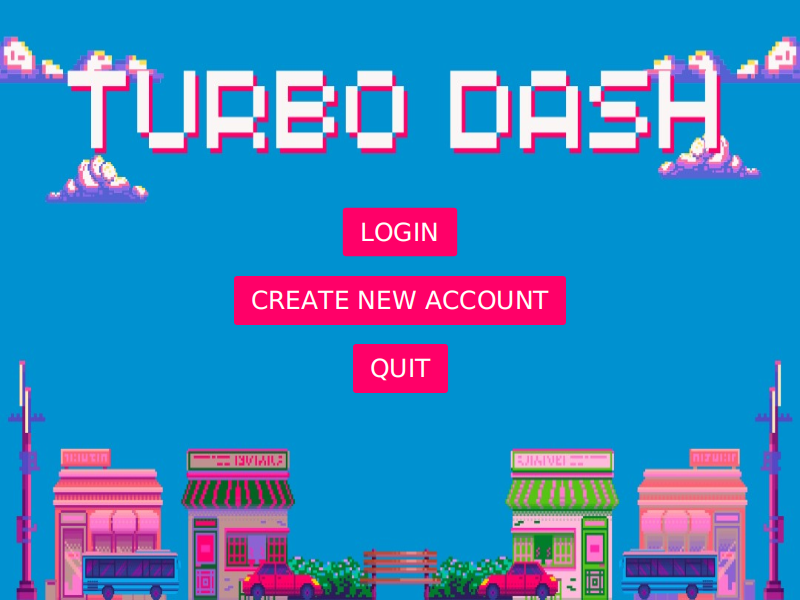
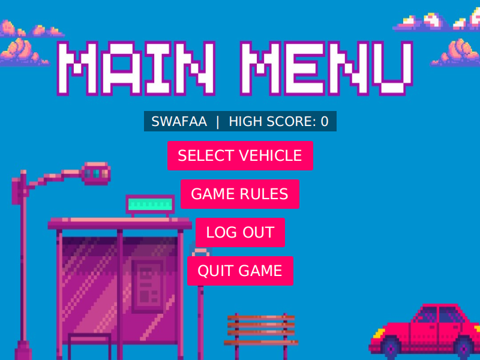
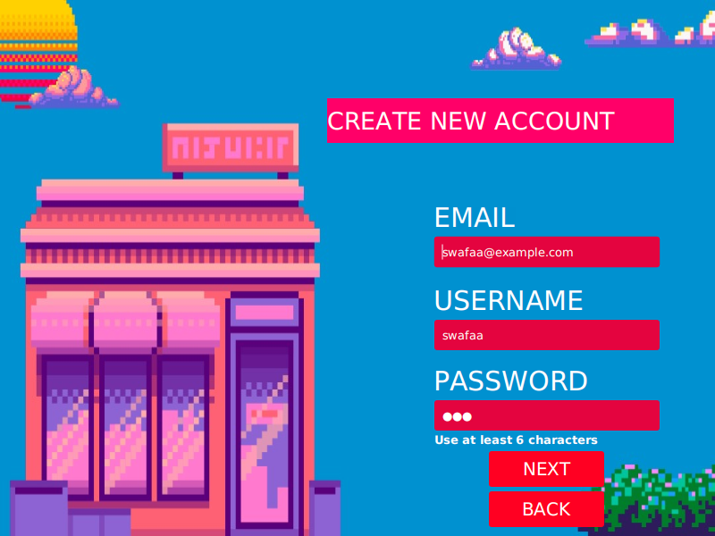
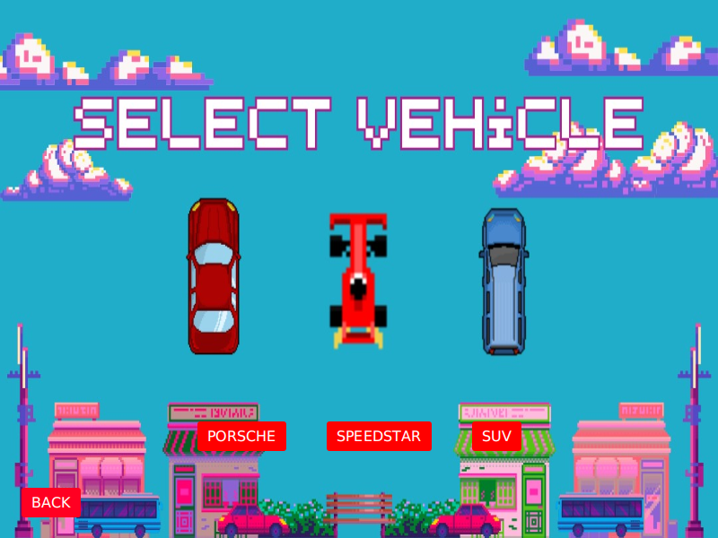

# Turbo Dash 🏎️

An endless car-dodging game built with **Java 21** and **JavaFX**. Steer between three lanes, avoid the traffic and obstacles, and see how long you can survive as the road gets faster.



[](https://github.com/swafaaomar-me/turbo-dash/actions/workflows/ci.yml)

## ▶️ Play it

**[Download the latest release](https://github.com/swafaaomar-me/turbo-dash/releases/latest)**. Java comes bundled, so you don't need to install anything.

| System  | Download                   | How to start                                                   |
|---------|----------------------------|----------------------------------------------------------------|
| Windows | `TurboDash-Windows.zip`    | Unzip, open the `TurboDash` folder, run `TurboDash.exe`        |
| macOS   | `TurboDash-macOS.zip`      | Unzip, then **right-click `TurboDash.app` → Open** (first time only, because the app isn't signed) |
| Linux   | `TurboDash-Linux.tar.gz`   | Extract, run `TurboDash/bin/TurboDash`                         |

## How to play

1. Create an account and log in.
2. Pick a car: **Porsche**, **Speedstar** or **SUV**.
3. Use the **← / →** arrow keys (or **A / D**) to switch lanes.
4. You score one point for every second you survive. Every 10 seconds the obstacles speed up, and every 10 points the scenery changes.
5. One crash ends the race. Your best score is saved to your account.

## Features

- **Accounts with secure passwords.** Multiple players can sign up. Passwords are hashed with PBKDF2 (a random salt per user) and never stored as plain text.
- **High scores per player**, saved between sessions.
- **Increasing difficulty.** Speed goes up over time, and four background and track themes rotate as your score grows.
- **Sound effects.** Looping background music and a crash sound.
- **Input validation** on sign-up (email format, unique username, minimum password length).
- Save data lives in a `.turbodash` folder in your home directory, so the installed game can always write to it.

## Screenshots

| Start screen | Main menu |
|---|---|
|  |  |
| **Create account (with validation)** | **Select vehicle** |
|  |  |

## Tech stack

- **Java 21**, **JavaFX 21** (controls, FXML, media)
- **Maven** build, **JUnit 5** tests
- **GitHub Actions**: builds and tests every push; on each release it uses `jlink` + `jpackage` to produce a self-contained app for Windows, macOS and Linux

## Run from source

You need JDK 21 or newer.

```bash
git clone https://github.com/swafaaomar-me/turbo-dash.git
cd turbo-dash
./mvnw javafx:run        # Windows: mvnw.cmd javafx:run
```

Run the tests with `./mvnw test`. (If you get *permission denied* on macOS/Linux, run `chmod +x mvnw` once.)

In **IntelliJ IDEA**: *File → Open* → select the folder, then run `Start` (or the Maven goal `javafx:run`).

## Project structure

```
src/main/java/com/example/turbodash/
├── Start.java              # Entry point: welcome screen
├── CreateAccount.java      # Sign-up form
├── Login.java              # Login form
├── MainMenu.java           # Menu with the player's high score
├── GameRules.java          # Rules screen
├── SelectVehicle.java      # Car selection
├── GameScreen.java         # Loads the game view (FXML)
├── GameController.java     # Game loop, steering, collisions, scoring, difficulty
├── UserDataManager.java    # Saves/loads accounts (Java serialization)
├── ScoreManager.java       # Saves/loads high scores per player
├── PasswordHasher.java     # PBKDF2 password hashing
├── User.java, Session.java, AppData.java, Assets.java, Ui.java
src/main/resources/         # Images, audio, game-view.fxml
src/test/java/              # JUnit tests for accounts, scores and hashing
```

## Releasing a new version

Push a version tag and GitHub Actions builds the downloads and attaches them to a new release:

```bash
git tag v1.0.0
git push origin v1.0.0
```

## Team

Turbo Dash started as a group project for the *Advanced Programming* module (ITS66704) at **Taylor's University**, 2024.

| Team member | Contribution |
|---|---|
| Brighton Moronda Moronda | Gameplay mechanics and UI, game class, visual design, obstacle and car logic |
| Mya Eirdina Sharn Kamel | Gameplay mechanics and UI, level/scene changes |
| Dhaavita Sookun | Login and create account, visual and audio design |
| **Swafaa Salim Said Omar** | Login and create account, visual and audio design, UI prototype |
| Andrea Lisa Philemon | Gameplay mechanics and UI, track and level scene changes |
| Sakina Hussein Meena | Gameplay mechanics and UI, vehicle selection, obstacle and car logic |

### Improvements since the original submission

- Accounts: support for multiple users, hashed passwords, input validation, per-player high scores
- Fixed the window close button reopening the menu instead of quitting after a race
- Stopped timers, music and off-screen obstacles from piling up after each race
- Moved save files to the user's home folder so packaged builds can save data
- Cleaned up the project structure (one `Application` class, clearer class and asset names)
- Added unit tests, CI, and one-click downloads for Windows, macOS and Linux

## License

© 2024 Turbo Dash Team. All rights reserved.
This code is shared for portfolio viewing only. You may not copy, modify, or reuse it without permission.
